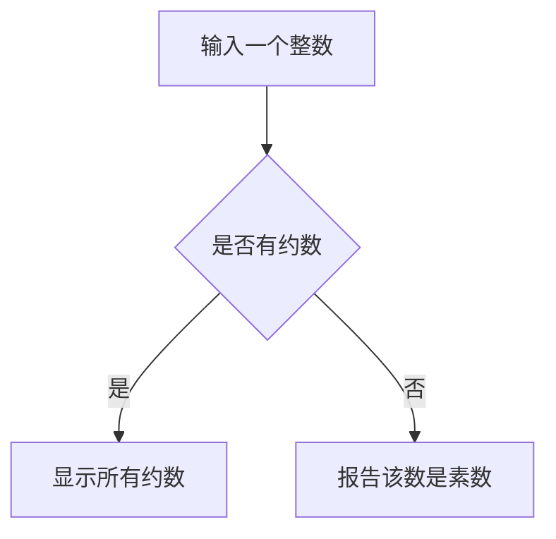

# Chapter 7

## 《C Primer Plus》中对`isPrime`函数的定义

**要求:给定一个整数,如果有约数,显示所有能整除他的约数,如果没有约数,则报告该数是一个素数.**



### 1. 是-->显示所有约数

- 输入一个整数`num`

- 设计一个循环,检测`2`~`num`之间所有的整数是否能被`num`整除,能则显示出来.
- 由数学知识,其实不需要检测`2`~`num`之间所有的整数,比如输入`144`检测出`2`是约数后,那么`72`也是`144` 的约数.因此,只需要检测到`num`的平方根即可.

```c
#include <stdio.h>
#include <stdbool.h>

int main(void)
{
	unsigned long num;	//待测试的数
	unsigned long div;	//可能的约数
	//使用long unsigned扩大整数的范围
	bool isPrime = true;

	scanf_s("%ld", &num);

	for (div = 2;(div * div) < num;div++)
	{
		if (num % div == 0)
		{
			if (div * div != num)
			{
				printf("%ld is divisibal by %ld and %ld.\n",
					num, div, num / div);
			}
			else
			{
				printf("%ld is divisibal by %ld.",
					num, div);
			}
		}
	}

	return 0;
}
```

### 2. 否-->显示报告该数是素数

- 否即代表没有进入`if`语句
- 声明一个`bool`类型变量`isPrime`并初始化为`true`,在内层`if`语句结束后,令`isPrime = false;`
- 这样在`for`循环结束后,通过判断`isPrime`的值,即可判断是否是素数,是则报告.

```c
#include <stdio.h>
#include <stdbool.h>

int main(void)
{
	unsigned long num;	//待测试的数
	unsigned long div;	//可能的约数
	//使用long unsigned扩大整数的范围
	bool isPrime = true;

	scanf_s("%lu", &num);

	for (div = 2;(div * div) < num;div++)
	{
		if (num % div == 0)
		{
			if (div * div != num)
			{
				printf("%lu is divisibal by %ld and %ld.\n",
					num, div, num / div);
			}
			else
			{
				printf("%lu is divisibal by %ld.",
					num, div);
			}
            isPrime = false;
		}
	}

	if (isPrime)
	{
		printf("%lu is prime.", num);
	}

	return 0;
}
```

为了可以连续使用多次程序,在外层包上一个`while`循环(同时添加适当引导语).于是,程序的完整代码:

```c
#include <stdio.h>
#include <stdbool.h>

int main(void)
{
	unsigned long num;	//待测试的数
	unsigned long div;	//可能的约数
	//使用long unsigned扩大整数的范围

	bool isPrime ;

	printf("Please enter a integer to analysis.(Q TO QUIT):");


	while (scanf_s("%lu", &num) == 1)
	{
		for (div = 2,isPrime = true;(div * div) < num;div++)
		{
			if (num % div == 0)
			{
				if (div * div != num)
				{
					printf("%lu is divisibal by %ld and %ld.\n",
						num, div, num / div);
				}
				else
				{
					printf("%lu is divisibal by %ld.",
						num, div);
				}
				isPrime = false;
			}
		}

		if (isPrime)
		{
			printf("%lu is prime.\n", num);
		}
		printf("Please enter a integer to analysis.(Q TO QUIT):");
	}

	printf("Bye!");

	return 0;
}
```

##  一个统计单词的程序

**要求:编写一个可以统计单词数量的程序,同时还可以统计字符数和行数.**

这个程序涉及哪些内容?

1. 逐个字符读取输入,知道何时停止.

   识别并计算字符数\行数\单词数

   ```
   读取一个字符
   当有更多字符输入时
   	递增字符计数
   	如果读完一行,递增行数计数
   	如果读完一个单词,递增单词计数
   
   前面放上一个while循环,检测到输入字符|时,停止.
   #define STOP '|'
   
   while((c = getchar() != STOP)
   {
   	...
   }
   ```

2. 在`while`循环中统计字符数和行数

   ```c
   int n_chars = 0L;		//字符数 L:long double
   int n_lines = 0;		//行数
   ```

   ```c
   while((c = getchar() != STOP)
   {
   	n_chars++;			//统计字符
       if(c == '\n')
       {
           n_lines++;
       }
   }
   ```

3. 棘手问题:识别单词

   我们用一个相对简单的方法,把一个单词定义为一个不含空白(空格,换行符,制表符)的字符序列.

   判断非空白字符:

   ```c
   c != ' ' && c!= '\n' && c != '\t' 
   ```

   判断空白字符:

   ```c
   c == ' ' || c== '\n' || c == '\t' 
   ```

   > `ctype.h`头文件中的函数`isspace()`
   >
   > 如果该函数的参数是空白字符,则返回为真,反之则返回假.

   使用函数`isspace()`可以更加便捷的判断空白
   
   要查找一个单词是否有某个字符,可以在程序读入单词首字母时把一个标记(`inword`)设置为1,在此时递增单词计数.然后,只要`inword`为1,后续的非空白字符就不记为单词的开始.
   
   下一个空白字符,必须重置为0.
   
   ```
   伪代码:
   如果c不是空白字符,且inword为0
   	设置inword为1,单词计数+1
   如果c是空白字符,且inword为1
   	设置inword为0
   ```
   
   我们可以使用`bool`类型表达上述判断:
   
   ```c
   #include <stdbool.h> 
   #include <ctype.h>   
   int n_words;
   bool inword = false;
   ```
   
   则在while循环中:
   
   ```c
   if(!isspace(c) && !inword)
   {
       inword = true;
       n_words+=;
   }
   if(isspace(c) && inword)
   {
       inword = false;
       n_words+=;
   }
   ```
   
   (注意:`if(inword)=if(inword == true)`,`if(!inword)=if(inword == false)`)

**完整代码:**

```c
#include <stdio.h>
#include <ctype.h>         // for isspace()
#include <stdbool.h>       // for bool, true, false
#define STOP '|'
int main(void)
{
    char c;                 // read in character
    char prev;              // previous character read
    long n_chars = 0L;      // number of characters
    int n_lines = 0;        // number of lines
    int n_words = 0;        // number of words
    int p_lines = 0;        // number of partial lines
    bool inword = false;    // == true if c is in a word
    
    printf("Enter text to be analyzed (| to terminate):\n");
    prev = '\n';            // used to identify complete lines
    while ((c = getchar()) != STOP)
    {
        n_chars++;          // count characters
        if (c == '\n')
            n_lines++;      // count lines
        if (!isspace(c) && !inword)
        {
            inword = true;  // starting a new word
            n_words++;      // count word
        }
        if (isspace(c) && inword)
            inword = false; // reached end of word
        prev = c;           // save character value
    }
    
    if (prev != '\n')
        p_lines = 1;
    printf("characters = %ld, words = %d, lines = %d, ",
           n_chars, n_words, n_lines);
    printf("partial lines = %d\n", p_lines);
    
    return 0;
}
```

## 1

```c
#include <stdio.h>

int main(void)
{
    int blank = 0;
    int endline = 0;
    int others = 0;
    char ch;

    printf("Please input chars(# TO QUIT)");

    while ((ch = getchar()) != '#')
    {
        if (ch = ' ')
            blank++;
        if (ch = '\n')
            endline++;
        else
            others++;
    }

    printf("%d blank, %d endline, %d others\n", blank, endline, others);

    return 0;
}
```

## 2 

```c
#include <stdio.h>

int main(void)
{
    char ch;
    int cnt = 0;

    printf("Please input chars (# TO QUIT):");

    while ((ch = getchar()) != '#')
    {
        if (cnt++ % 8 == 0)
        {
            printf("\n");
        }
        if (ch == '\n')
        {
            printf("'\\n'-%03d.", ch);
        }
        else if (ch == '\t')
        {
            printf("'\\t'-%03d.", ch);
        }
        else
        {
            printf("'%c'-%03d.", ch, ch);
        }
    }
    printf("Done\n");

    return 0;
}
```

## 3

```c
#include <stdio.h>

int main(void)
{
    int num;
    int numOfEven = 0;
    int numOfOdd = 0;
    int sumOfEven = 0;
    int sumOfOdd = 0;
    float evenAverange;
    float oddAverange;

    printf("Please enter an integer:");
    while (scanf_s("%d", &num))
    {
        if (num == 0)
            break;
        if (num % 2 == 0)
        {
            numOfEven++;
            sumOfEven += num;
        }

        else
        {
            numOfOdd++;
            sumOfOdd += num;
        }

    }

    evenAverange = 1.0 * sumOfEven / numOfEven;
    oddAverange = 1.0 * sumOfOdd / numOfOdd;

    printf("The number of even is %d, and their average is %.2f",
        numOfEven, evenAverange);
    printf("The number of odd is %d, and their average is %.2f",
        numOfOdd, oddAverange);

    return 0;
}
```

## 4

```c
#include <stdio.h>

int main(void)
{
    int cnt = 0;
    char ch;

    printf("Please input cars(# for exit)");

    while (ch = getchat() != '#')
    {
        if (ch = '!')
        {
            printf("!!");
            cnt++;
        }
        else if (ch = '.')
        {
            printf("!");
            cnt++;
        }
        else
        {
            printf("%c", ch);
        }
    }
    printf("\nTotal replaces %d times\n", cnt);
    printf("Done!\n");

    return 0;
}
```

## 5

```c
#include <stdio.h>

int main(void)
{
    int cnt = 0;
    char ch;

    printf("Please input cars(# for exit)");

    while (ch = getchat() != '#')
    {
        switch (ch)
        {
            case '!':
                printf("!!");
                cnt++;
                break;
            case '.':
                printf("!");
                cnt++;
                break;
            default:
                printf("%c", ch);
        }
    }
    printf("\nTotal replaces %d times\n", cnt);
    printf("Done!\n");

    return 0;
}
```

## 7

```c
#include <stdio.h>
#define BASIC_SALARY 10.00 
#define EXTRA_HOUR 1.5
#define BASIC_TAX 0.15
#define EXTRA_TAX 0.2
#define EXCEED_TAX 0.25

int main(void)
{
    float hours;
    float totalSalary;
    float tax;
    float netIncome;


    printf("Please enter your number of hours working for 1 week :");
    scanf_s("%f", &hours);

    if (hours <= 40)
    {
        totalSalary = BASIC_SALARY * hours;
    }
    else
    {
        totalSalary = BASIC_SALARY * EXTRA_HOUR * hours;
    }
    if (totalSalary <= 300)
    {
        tax = totalSalary * BASIC_TAX;
    }
    else if(totalSalary > 300 && totalSalary <= 450)
    {
        tax = 300 * BASIC_TAX + (totalSalary - 300) * EXTRA_TAX;
    }
    else if (totalSalary > 450)
    {
        tax = 300 * BASIC_TAX + 150 * EXTRA_TAX + (totalSalary - 450) * EXCEED_TAX;
    }
    netIncome = totalSalary - tax;
    printf("Total Salary : %.2f\ntax : %.0f\nnet income : %.0f\n",totalSalary,tax, netIncome);

    return 0;
}
```

## 8

```c
#include <stdio.h>
#define EXTRA_HOUR 1.5
#define BASIC_TAX 0.15
#define EXTRA_TAX 0.2
#define EXCEED_TAX 0.25

float menu(void);
void printincome(float basicSalary);

int main(void)
{
    float basicSalary = menu();

    printincome(basicSalary);

    return 0;
}

void printincome(float basicSalary)
{ 
    float hours;
    float totalSalary;
    float tax;
    float netIncome;

    if (basicSalary == 0)
    {
        printf("Thanks for using.");
    }
    else
    {
        printf("Please enter your number of hours working for one week :");
        scanf_s("%f", &hours);

        if (hours <= 40)
        {
            totalSalary = basicSalary * hours;
        }
        else
        {
            totalSalary = basicSalary * EXTRA_HOUR * hours;
        }
        if (totalSalary <= 300)
        {
            tax = totalSalary * BASIC_TAX;
        }
        else if (totalSalary > 300 && totalSalary <= 450)
        {
            tax = 300 * BASIC_TAX + (totalSalary - 300) * EXTRA_TAX;
        }
        else if (totalSalary > 450)
        {
            tax = 300 * BASIC_TAX + 150 * EXTRA_TAX + (totalSalary - 450) * EXCEED_TAX;
        }

        netIncome = totalSalary - tax;

        printf("Total Salary : %.2f\ntax : %.0f\nnet income : %.0f\n", totalSalary, tax, netIncome);
    }
}

float menu(void)
{
    int num ;
    float basicSalary = 0;
    char s1[] = "1) $8.75/hr";
    char s2[] = "2) $9.33/hr";
    char s3[] = "3) $10.00/hr";
    char s4[] = "4) $11.20/hr";
    char s5[] = "5) $quit";

    printf("******************************************************************\n\n");

    printf("Salary Level\n\n");

    printf("%s\t", s1);
    printf("%s\n\n", s2);
    printf("%s\t", s3);
    printf("%s\n\n", s4);
    printf("%s\n\n", s5);

    printf("******************************************************************\n\n");

    printf("Enter the number corresponding to the desired pay rate or action:");
    scanf_s("%d", &num);
   

    switch (num)
    {
        case 1:
            basicSalary = 8.75;
            break;
        case 2:
            basicSalary = 9.33;
            break;
        case 3:
            basicSalary = 10.00;
            break;
        case 4:
            basicSalary = 11.20;
            break;

    }

    return basicSalary;
}
```

