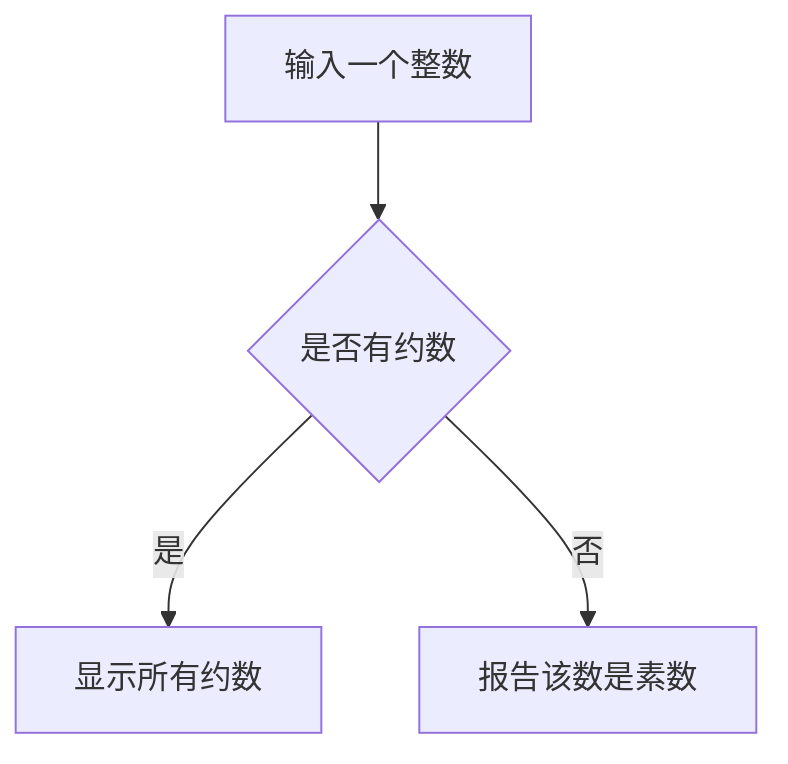

# Prime

**目的:按照要求输出素数**

思路:在大于1的自然数中，除了1和它本身以外不再有其他因数的自然数是素数

## **实例一 **

### 输出100以内素数及其和

- 已知第一个素数是2,那么从2开始,每个自然数`i`除以<u>大于2小于他本身的自然数`j`</u>
- 如果存在可以整除的自然数`j`,那么`i`就不是素数,反之则是.
- 然后输出所有素数.

**完整代码:**

```c
#include <stdio.h>
int main(void)
{
	printf("100以内的素数表及其和\n");

	int i ;
	int j ;
	int sum = 0;
	
	for (i = 2;i < 100;i++) {
		int n = 1 ;
		for (j = 2;j < i;j++) {
			if (i % j == 0) {
				n = 0;
				break;
                /*节约循环次数,如果有一个符合条件的i,那么n = 0后可以直接break.*/
			}
		}
		if (n == 1) {
			printf("%d\n", i);
			sum = sum + i;
            /*素数加一起.*/
		}
	}
	printf("100以内所有素数和为%d", sum);
	return 0;
}
```

## **实例二**

### 输出前100个素数

使用数组和函数

- 定义100以内的素数数组``prime[100] = {2} /*易知prime[0] = 2*/``
- 用``isPrime``函数从3开始,一直到100依次判断每一个数是否是素数
- 如果是,讲这个素数写入素数数组的对应位置

代码块:

```C
int prime[100] = {2};
int i = 3;
int count = 1;
/*已知prime[0] = 2,故count从1开始,直到count=99时,得到prime[100]*/

while(count < 100){
    if (isPrime(/*具体先不写*/)){
        prime[count++] = i;/*小套路写法*/
    }
    i++;
}
```

- 定义``isPrime``函数用于判断``i``是否是素数

**函数定义:**

- 判断``x``是否是素数只需用``x``除以所有比他小的素数

- 如果能整除,则不是素数,反之则是.

- 例如:

  | `i`  | 比`i`小的素数 | 运算                      | 是/否是素数 |
  | ---- | ------------- | ------------------------- | ----------- |
  | 3    | 2             | 3 % 2 !=0                 | 是          |
  | 4    | 2,3           | 4 % 2 = 0                 | 不是        |
  | 5    | 2,3           | 5 % 2 != 0<br/>5 % 3 != 0 | 是          |
  | 6    | 2,3,5         | 6 % 2 = 0<br/>6 % 3 = 0   | 不是        |

代码块:

```C
int isPrime(int x,int knownPrimes[],int numberOfKnownPrimes)
{
	int ret = 1;
	int i;
	for (i = 0;i < numberOfKnownPrimes;i++) {
		if (x % knownPrimes[i] == 0) {
			ret = 0;
			break;
		}
	}
	return ret;
    /*C 语言把任何非零和非空的值假定为 true，把零或 null 假定为 false*/
}
```

函数引用代码块:

```C
isPrime(i,prime,count);
```

**完整代码**

```C
#include<stdio.h>

int isPrime(int x, int knownPrimes[], int numberOfKnownPrimes);

int main(void)
{
	int prime[100] = { 2 };
	int count = 1;
	int i = 3;

	while (count < 100) {
		if (isPrime(i, prime, count)) {
			prime[count++] = i;
		}
		i++;
	}
	for (i = 0;i < 100;i++) {
		printf("%d",prime[i]);
			if ((i + 1) % 5) {
				printf("\t");
			}else{ printf("\n"); }
	}/*排版*/
	return 0;
}

int isPrime(int x,int knownPrimes[],int numberOfKnownPrimes)
{
	int ret = 1;
	int i;
	for (i = 0;i < numberOfKnownPrimes;i++) {
		if (x % knownPrimes[i] == 0) {
			ret = 0;
			break;
		}
	}
	return ret;
}
```

## 实例三

### 《C Primer Plus》中对`isPrime`函数的定义

**要求:给定一个整数,如果有约数,显示所有能整除他的约数,如果没有约数,则报告该数是一个素数.**



#### 1. 是-->显示所有约数

- 输入一个整数`num`

- 设计一个循环,检测`2`~`num`之间所有的整数是否能被`num`整除,能则显示出来.
- 由数学知识,其实不需要检测`2`~`num`之间所有的整数,比如输入`144`检测出`2`是约数后,那么`72`也是`144` 的约数.因此,只需要检测到`num`的平方根即可.

```c
#include <stdio.h>
#include <stdbool.h>

int main(void)
{
	unsigned long num;	//待测试的数
	unsigned long div;	//可能的约数
	//使用long unsigned扩大整数的范围
	bool isPrime = true;

	scanf_s("%ld", &num);

	for (div = 2;(div * div) < num;div++)
	{
		if (num % div == 0)
		{
			if (div * div != num)
			{
				printf("%ld is divisibal by %ld and %ld.\n",
					num, div, num / div);
			}
			else
			{
				printf("%ld is divisibal by %ld.",
					num, div);
			}
		}
	}

	return 0;
}
```

#### 2. 否-->显示报告该数是素数

- 否即代表没有进入`if`语句
- 声明一个`bool`类型变量`isPrime`并初始化为`true`,在内层`if`语句结束后,令`isPrime = false;`
- 这样在`for`循环结束后,通过判断`isPrime`的值,即可判断是否是素数,是则报告.

```c
#include <stdio.h>
#include <stdbool.h>

int main(void)
{
	unsigned long num;	//待测试的数
	unsigned long div;	//可能的约数
	//使用long unsigned扩大整数的范围
	bool isPrime = true;

	scanf_s("%lu", &num);

	for (div = 2;(div * div) < num;div++)
	{
		if (num % div == 0)
		{
			if (div * div != num)
			{
				printf("%lu is divisibal by %ld and %ld.\n",
					num, div, num / div);
			}
			else
			{
				printf("%lu is divisibal by %ld.",
					num, div);
			}
            isPrime = false;
		}
	}

	if (isPrime)
	{
		printf("%lu is prime.", num);
	}

	return 0;
}
```

为了可以连续使用多次程序,在外层包上一个`while`循环(同时添加适当引导语).于是,程序的完整代码:

```c
#include <stdio.h>
#include <stdbool.h>

int main(void)
{
	unsigned long num;	//待测试的数
	unsigned long div;	//可能的约数
	//使用long unsigned扩大整数的范围

	bool isPrime ;

	printf("Please enter a integer to analysis.(Q TO QUIT):");


	while (scanf_s("%lu", &num) == 1)
	{
		for (div = 2,isPrime = true;(div * div) < num;div++)
		{
			if (num % div == 0)
			{
				if (div * div != num)
				{
					printf("%lu is divisibal by %ld and %ld.\n",
						num, div, num / div);
				}
				else
				{
					printf("%lu is divisibal by %ld.",
						num, div);
				}
				isPrime = false;
			}
		}

		if (isPrime)
		{
			printf("%lu is prime.\n", num);
		}
		printf("Please enter a integer to analysis.(Q TO QUIT):");
	}

	printf("Bye!");

	return 0;
}
```

